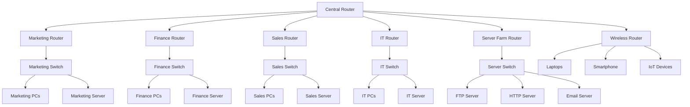

# Corporate Office Network Project – Cisco Packet Tracer

## Project Overview

This project is a **Corporate Office Network Simulation** developed in **Cisco Packet Tracer** for a Computer Networks course. The network demonstrates how different departments in an organization communicate through a centralized routing infrastructure.

The topology includes:

* Multiple departmental LANs
* Centralized routing
* Wireless network connectivity
* IoT devices
* Dedicated servers for services like FTP, HTTP, and Email
* Dynamic communication between all departments

The purpose of this project is to understand:

* Network design and topology planning
* Router and switch configuration
* IP addressing and subnetting
* Routing protocols
* Wireless networking
* Server configuration
* IoT integration
* End-to-end communication testing

---

# Network Departments

The corporate office is divided into the following departments:

1. Marketing Department
2. Finance Department
3. Sales Department
4. IT Department
5. Central Administration Network
6. Wireless & IoT Network
7. Server Farm

---

# Main Components Used

## Routers

* Cisco 2811 Routers
* Central Router connects all departments

## Switches

* Cisco 2960-24TT Switches

## End Devices

* PCs
* Laptops
* Smartphones

## Servers

* DNS/General Server
* FTP Server
* HTTP Server
* Email Server

## Wireless Devices

* Wireless Router
* Home Gateway

## IoT Devices

* Fan
* Light
* Temperature Monitor

---

# Network Addressing Scheme

| Department            | Network Address |
| --------------------- | --------------- |
| Marketing             | 10.0.0.0        |
| Finance               | 11.0.0.0        |
| Sales                 | 12.0.0.0        |
| IT                    | 13.0.0.0        |
| Server Farm           | 14.0.0.0        |
| Marketing Serial Link | 15.0.0.0        |
| Finance Serial Link   | 16.0.0.0        |
| Sales Serial Link     | 17.0.0.0        |
| IT Serial Link        | 18.0.0.0        |
| Server Serial Link    | 19.0.0.0        |
| Wireless Network      | 20.0.0.0        |

---

# Logical Structure Diagram

```text
                                   +----------------+
                                   | Central Router |
                                   +--------+-------+
                                            |
        -------------------------------------------------------------------
        |              |               |               |                  |
        |              |               |               |                  |
   15.0.0.0       16.0.0.0        17.0.0.0       18.0.0.0          19.0.0.0
        |              |               |               |                  |
        |              |               |               |                  |
+---------------+ +---------------+ +---------------+ +---------------+ +----------------+
| Marketing     | | Finance       | | Sales         | | IT            | | Server Farm    |
| Router         | | Router        | | Router        | | Router        | | Router         |
+-------+-------+ +-------+-------+ +-------+-------+ +-------+-------+ +--------+-------+
        |                 |                 |                 |                  |
    +---+---+         +---+---+         +---+---+         +---+---+         +----+----+
    | Switch |         | Switch |         | Switch |         | Switch |         | Switch |
    +---+---+         +---+---+         +---+---+         +---+---+         +----+----+
        |                 |                 |                 |                  |
   PCs & Server      PCs & Server      PCs & Server      PCs & Server      FTP/HTTP/
                                                                       Email Servers


                    +--------------------------------+
                    | Wireless Router & IoT Network |
                    +---------------+----------------+
                                    |
               ------------------------------------------------
               |              |              |                |
            Laptop         Smartphone      Fan             Light
                                              |
                                      Temperature Monitor
```

---

# Hierarchical Network Structure



---

# Department Details

## 1. Marketing Department

### Devices

* Router0
* Switch0
* PC0, PC1, PC2
* Server0

### Network

* LAN: 10.0.0.0
* Serial Link: 15.0.0.0

### Credentials

* Username: marketing
* Password: 123

---

## 2. Finance Department

### Devices

* Router1
* Switch1
* PC3, PC4, PC5
* Server1

### Network

* LAN: 11.0.0.0
* Serial Link: 16.0.0.0

### Credentials

* Username: finance
* Password: 123

---

## 3. Sales Department

### Devices

* Router2
* Switch2
* PC6, PC7, PC8
* Server2

### Network

* LAN: 12.0.0.0
* Serial Link: 17.0.0.0

### Credentials

* Username: sales
* Password: 123

---

## 4. IT Department

### Devices

* Router3
* Switch3
* PC9, PC10, PC11
* Server3

### Network

* LAN: 13.0.0.0
* Serial Link: 18.0.0.0

### Credentials

* Username: IT
* Password: 123

---

## 5. Server Farm

### Devices

* FTP Server
* HTTP Server
* Email Server

### Network

* LAN: 14.0.0.0
* Serial Link: 19.0.0.0

### Services Provided

* FTP File Transfer
* Web Hosting
* Email Communication

---

## 6. Wireless and IoT Network

### Devices

* Wireless Router
* Laptops
* Smartphone
* Fan
* Light
* Temperature Monitor

### Wireless Network

* Network: 20.0.0.0
* Wireless Password: 12345678

---

# Routing Configuration

The project can use:

* Static Routing
  OR
* Dynamic Routing (RIP v2 / OSPF)

Recommended:

```bash
router rip
version 2
no auto-summary
network 10.0.0.0
network 11.0.0.0
network 12.0.0.0
network 13.0.0.0
network 14.0.0.0
network 15.0.0.0
network 16.0.0.0
network 17.0.0.0
network 18.0.0.0
network 19.0.0.0
network 20.0.0.0
```

---

# Features Implemented

## Network Connectivity

* Inter-department communication
* Centralized routing
* End-to-end packet transmission

## Wireless Communication

* Wireless access for laptops and smartphones

## IoT Integration

* Smart home devices connected through gateway

## Server Services

* FTP Service
* HTTP Service
* Email Service

## Security

* Password-protected wireless network
* Department user authentication

---

# Testing Performed

## Ping Test

Used to verify:

* PC to PC communication
* PC to Server communication
* Inter-department communication

Example:

```bash
ping 14.0.0.2
```

## FTP Test

```bash
ftp 14.0.0.3
```

## HTTP Test

Open browser and access:

```text
http://14.0.0.4
```

---

# Learning Outcomes

After completing this project, the following concepts were understood:

* LAN and WAN design
* Router configuration
* Switch configuration
* Serial communication
* Dynamic routing protocols
* Wireless networking
* IoT networking
* Server deployment
* IP addressing and subnetting
* Troubleshooting and connectivity testing

---

# Software Used

* Cisco Packet Tracer

---

# Future Improvements

Possible future enhancements:

* VLAN implementation
* DHCP server integration
* OSPF multi-area routing
* Firewall security
* Access Control Lists (ACL)
* NAT and Internet simulation
* Network monitoring system

---

# Conclusion

This project successfully demonstrates the design and implementation of a complete corporate office network using Cisco Packet Tracer. The topology integrates multiple departments, wireless communication, servers, and IoT devices into a centralized infrastructure.

The project provides practical understanding of real-world networking concepts including routing, switching, wireless networking, and server communication.
